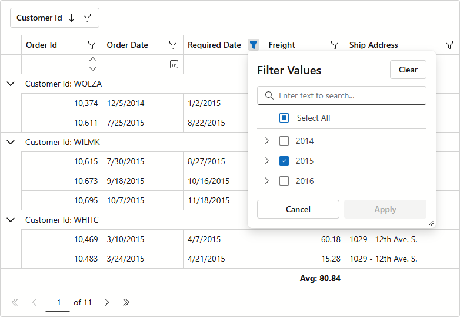

<!-- default badges list -->

<!-- default badges end -->
# Blazor Grid - Custom Data Source Binding using Entity Framework Core

This example uses a custom data source and binds it to the [DevExpress Blazor Grid](https://docs.devexpress.com/Blazor/403143/components/grid) via [Entity Framework Core](https://learn.microsoft.com/en-us/ef/core/).

Our Blazor Grid component supports [multiple data binding options](https://docs.devexpress.com/Blazor/403737/components/grid/bind-to-data). If our standard data source bindings do not meet specific business requirements, you can implement your own data provider. To do so, create a [GridCustomDataSource](https://docs.devexpress.com/Blazor/DevExpress.Blazor.GridCustomDataSource) descendant and assign it to the Grid [Data](https://docs.devexpress.com/Blazor/DevExpress.Blazor.DxGrid.Data) property. As a starting point, simply use the [OrdersDataSource](./CS/CustomDataSource/Services/OrdersDataSource.cs) class implementation and modify it based on your use case/requirements.

## Limitations & Considerations

Note the following Grid-related limitations when using a custom data source:

* [Custom sorting](https://docs.devexpress.com/Blazor/DevExpress.Blazor.DxGrid.CustomSort) is unavailable.
* [Interval](https://docs.devexpress.com/Blazor/DevExpress.Blazor.DxGridDataColumn.GroupInterval)/[custom](https://docs.devexpress.com/Blazor/DevExpress.Blazor.DxGridDataColumn.GroupInterval#custom-grouping) grouping is unavailable.
* [Search](https://docs.devexpress.com/Blazor/404142/components/grid/data-shaping/filter-data/search-box), [filter](https://docs.devexpress.com/Blazor/DevExpress.Blazor.DxGridDataColumn.FilterMode#filter-data-by-display-text), [sorting](https://docs.devexpress.com/Blazor/DevExpress.Blazor.DxGridDataColumn.SortMode#sort-data-by-display-text), and [grouping](https://docs.devexpress.com/Blazor/DevExpress.Blazor.DxGridDataColumn.GroupInterval) against display text are unavailable.
* Sorting, filtering, or data grouping during _select_/_deselect all_ processing cancels the operation.
* [Custom summary calculation](https://docs.devexpress.com/Blazor/DevExpress.Blazor.DxGrid.CustomSummary) is unavailable.
* [Unbound columns](https://docs.devexpress.com/Blazor/DevExpress.Blazor.DxGridDataColumn#create-an-unbound-column) are unsupported.
* To call the [SetFocusedDataItemAsync](https://docs.devexpress.com/Blazor/DevExpress.Blazor.DxGrid.SetFocusedDataItemAsync(System.Object)) method, you must specify the [KeyFieldName](https://docs.devexpress.com/Blazor/DevExpress.Blazor.DxGrid.KeyFieldName)/[KeyFieldNames](https://docs.devexpress.com/Blazor/DevExpress.Blazor.DxGrid.KeyFieldNames) property value.
* `AllPages` mode ([Select All checkbox](https://docs.devexpress.com/Blazor/DevExpress.Blazor.DxGrid.KeyFieldNames)) is unsupported.
* [SelectAllAsync](https://docs.devexpress.com/Blazor/DevExpress.Blazor.DxGrid.SelectAllAsync(System.Boolean)) and [DeselectAllAsync](https://docs.devexpress.com/Blazor/DevExpress.Blazor.DxGrid.DeselectAllAsync) methods load all data and can impact overall performance and increase memory consumption.
* A second call to the [SelectAllAsync](https://docs.devexpress.com/Blazor/DevExpress.Blazor.DxGrid.SelectAllAsync(System.Boolean))/[DeselectAllAsync](https://docs.devexpress.com/Blazor/DevExpress.Blazor.DxGrid.DeselectAllAsync) method cancels the operation initiated by a previously called method.

## Files to Review

- [OrdersDataSource.cs](./CS/CustomDataSource/Services/OrdersDataSource.cs)
- [Index.razor](./CS/CustomDataSource/Components/Pages/Index.razor)
- [Order.cs](./CS/CustomDataSource/Models/Order.cs)

## Documentation

- [Bind Blazor Grid to Data](https://docs.devexpress.com/Blazor/403737/components/grid/bind-to-data)

## More Examples

- [Blazor Grid - ExpandoObject Collection Support](https://github.com/DevExpress-Examples/blazor-editable-grid-with-expandoobject)
- [Blazor Grid – Binding to a DevExtreme Data Source with Entity Framework Core](https://github.com/DevExpress-Examples/blazor-dxgrid-bind-to-devextreme-data-source)

<!-- feedback -->
## Does this example address your development requirements/objectives?

 

(you will be redirected to DevExpress.com to submit your response)
<!-- feedback end -->

